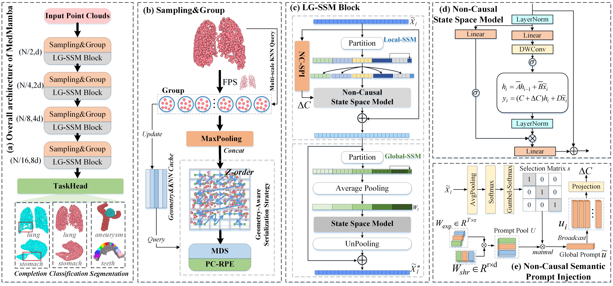

# MedMamba: Efficient Non-Causal State Space Modeling for 3D Medical Point Cloud Analysis

## MedMamba Overview

<p align="center">
  
</p>

## 1. Environment

The code has been tested on Ubuntu 20.04 with 4 A40 GPUs (48GB memory).

1. Python 3.10.13

    ```bash
    conda create -n medmamba python=3.10.13
    conda activate medmamba
    ```

2. Install torch 2.1.1 + cu118

    ```bash
    pip install torch==2.1.1 torchvision==0.16.1 torchaudio==2.1.1 --index-url https://download.pytorch.org/whl/cu118
    ```

Install PyTorch and torchvision using the command provided for your CUDA
version at the official PyTorch website.

3. Clone this repository and install the requirements.

    ```bash
    pip install -r requirements.txt
    ```

4. Run the following command from the repository root:

    ```bash
    pip install -e .
    ```

This installs the `train_flemme` and `test_flemme` command-line entry points and builds the point-cloud, Chamfer distance, and EMD extensions. The
extensions must be compiled for the active Python, PyTorch, and CUDA versions.
If compilation targets need adjustment, update `cuda_arch_list` in
`flemme/config.py` before installation.

## Dataset

MedPointS is a medical point-cloud dataset based on MedShapeNet and supports
anatomy classification, completion, and segmentation.

### 1. MedPointS 

Download the dataset manually from one of the following sources:
- [MedPointS classification on Hugging Face](https://huggingface.co/datasets/wlsdzyzl/MedPointS-cls)
- [MedPointS completion on Hugging Face](https://huggingface.co/datasets/wlsdzyzl/MedPointS-cpl)
- [MedPointS segmentation on Hugging Face](https://huggingface.co/datasets/wlsdzyzl/MedPointS-seg)

Extract and process the downloaded files locally. A recommended root is:

```text
data/MedPointS/
```

### 2.IntrA
Download `fileSplit`, `geo.zip` and `IntrA.zip` from [IntrA repository](https://github.com/intra3d2019/IntrA)  

Unzip `geo.zip` and `IntrA.zip` into `geo` and `IntrA` foler  

Move the unzipped `geo` folder into `IntrA/annoated/geo`  

Move the `fileSplit` into `IntrA/split`
  
Create one foler data in the code respository and add one symbolic link  

`mkdir data && ln -s Yourpath/IntrA data/IntrA`


### 3.Teeth3DS

Teeth3DS is a large-scale 3D oral scan mesh dataset released for the MICCAI
2022 3D Teeth Scan Segmentation and Labeling Challenge. It contains 1,800
upper- and lower-jaw models with per-vertex semantic and instance annotations.
The dataset is a general benchmark for 3D tooth semantic and instance
segmentation in challenging cases, including crowded dentitions, ambiguous
gingival boundaries, and malformed teeth.

Download the dataset from the [Teeth3DS OSF repository](https://osf.io/xctdy/overview).

## Train/test the Model 
```bash
## Classification
train_flemme --config ./resources/pcd/medpoints/cls/train_medmamba_clm.yaml
test_flemme --config ./resources/pcd/medpoints/cls/test_medmamba_clm.yaml

## Completion
CUDA_VISIBLE_DEVICES=0 train_flemme --config ./resources/pcd/medpoints/cpl/train_medmamba_cpl.yaml
CUDA_VISIBLE_DEVICES=0 test_flemme --config ./resources/pcd/medpoints/cpl/test_medmamba_cpl.yaml

## Segmentation
CUDA_VISIBLE_DEVICES=1 train_flemme --config ./resources/pcd/medpoints/seg/train_medmamba_sem.yaml
CUDA_VISIBLE_DEVICES=1 test_flemme --config ./resources/pcd/medpoints/seg/test_medmamba_sem.yaml
```
